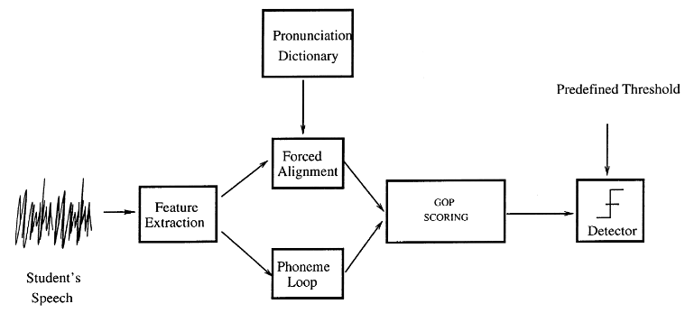
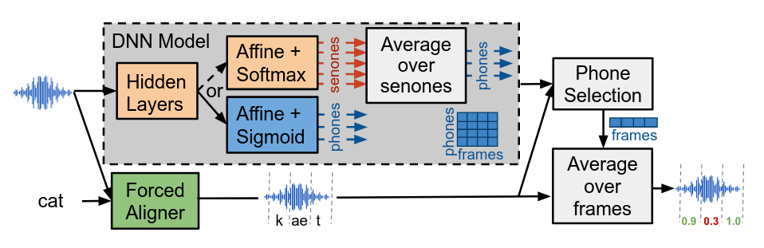

# Tổng quan về bài toán Pronunciation Scoring (PS)

> Phase 01: Nghiên cứu tổng quan & Chuẩn bị dữ liệu\
>
> Description
> - Nghiên cứu, khảo sát tổng quan các công trình liên quan đến bài toán PS trong và ngoài nước.
> - Tìm hiểu một số kiến trúc PS tổng thể, hệ thống end-to-ends.

## Nội dung

- [1. Tổng quan về bài toán](#tổng-quan-về-bài-toán)
- [2. Một số phương pháp nổi bật](#một-số-phương-pháp-nổi-bật)
- [3. Kiến trúc PS tổng thể]()
- [4. Tài liệu tham khảo]()

## Tổng quan về bài toán

Hệ thống hỗ trợ học ngôn ngữ bằng máy tính (Computer-Assisted Language Learing - CALL) mang lại nhiều lợi ích thiết thực trong giáo dục, đặc biệt là đối với giáo viên và học sinh. Những hệ thống này cho phép cung cấp phản hồi liên tục cho người học mà không cần sự giám sát thường trực của giáo viên, hỗ trợ việc tự học, khuyến khích sử dụng ngôn ngữ một cách tương tác thay vì phụ thuộc vào các phương pháp học truyền thống như học thuộc lòng hay ghi chép. Bên cạnh đó, CALL cũng góp phần đơn giản hóa và tự động hóa các quy trình đánh giá năng lực ngôn ngữ.

Một trong những thành phần cốt lõi và đầy thác thức trong hệ thông CALL là chấm điểm phát âm (Pronuncation Scoring). Đây là nhiệm vụ quan trọng nhằm đánh giá mức độ chĩnh xác trong các phát âm của người học so với chuẩn của người bản ngữ. Hệ thống chầm điểm phát âm hiệu quả không chỉ giúp phát hiện và sửa lỗi kịp thời mà còn cung cấp phản hồi mang tính dài hạn về năng lực phát âm của người học.

Trong nhiều năm qua, đã có rất nhiều các nghiên cứu, hướng tiếp cận chính như:

- Phương pháp dựa trên mô hình nhận dạng tiếng nói (ASR-based methods): Đây là một trong những phương pháp cổ điển và rất phổ biến, trong đó hệ thống nhận dạng giọng nói thường sử dụng mô hình Markov ẩn (Hidden Markow Model) nhằm so sánh phát âm của người học với các mô hình âm học chuẩn. Một trong những kỹ thuật nổi bật là thuật toán Goodness of Pronunciation (GOP) cho phép tính điểm phát âm ở cấp độ âm vị (phone-level).

- Đánh giá dựa trên so sánh với mẫu người bản ngữ (Template-based / Reference-based methods): Các phương pháp này so sánh trực tiếp tín hiệu âm thanh của người học với bản ghi âm từ người bản ngữ. Chúng thường yêu cầu dữ liệu huấn luyện riêng cho từng từ hoặc cụm từ, khiến hệ thống trở nên text-dependent và rất khó để có thể mở rộng.

- Mô hình học máy và học sâu (Machine Learning / Deep Learning-based methods): Gần đây, các mô hình học sâu như CNN, RNN và đặc biệt là các mô hình transformer-based (wav2vec, HuBERT, v.v.) đước sử dụng để trích xuất đặc trưng âm học và xây dựng bộ chấm điểm phát âm mà không cần phải phụ thuộc hoàn toán vào pipeline của hệ thống nhận dạng truyền thống.

Ngoài ra, các nghiên cứu khác cũng khai thác triệt để những yếu tố đặc trưng của âm thanh như trường độ, ngữ điệu, v.v, nhằm đánh giá chất lượng phát âm một cách toán diện hơn. Tuy nhiên, chúng vấn đang gặp phải rất nhiều những thách thức liên quan đến sự phụ thuộc vào dữ liệu, sự nhất quát và công bằng trong đánh giá và sự thích nghi khi dữ liệu giọng nói đa dạng. 

## Một số phương pháp nổi bật
### Goodness of Pronunciation

[GOP (Goodness of Pronunciation)](http://svr-www.eng.cam.ac.uk/~sjy/papers/wiyo00.pdf) là phương pháp là một trong những ký thuật nổi bật, với mục tiêu đo lường mức độ khớp giữa phát âm của người học và cách phát âm chuẩn của người bản ngữ, tính tại mức âm vị (phone-level). Gỉa sử khi chúng ta phát âm từ **cat** nó sẽ có hai âm vị là **/ka/** và **/et/**. GOP sẽ chấm điểm xem người dùng đã phát âm **/ka/** tốt đến đâu và **/et/** tốt đến đâu. 

**Công thức GOP:**

$$
\text{GOP} = \frac{1}{NF_\text{(p)}} \cdot \left| \text{log} \left( \frac{p(O^\text{(p)}) | p}{\max_{q \in \mathbf{Q}} p(O^\text{(p)}) | q} \right) \right|
$$

- Tử số $p(O^\text{(p)}) | p$: Đây là khả năng đoạn âm thanh $O(p)$ được tạo ra bởi đúng âm vị $p$. Chúng cho biết âm thanh thực tế khớp với âm vị mà chúng ta mong đợi nghe thấy đến mức nào.

- Mẫu số $\max_{q \in \mathbf{Q}} p(O^\text{(p)}) | q$: Đây là khả năng đoạn âm thanh $O(p)$ được tạo ra bởi âm vị khớp tốt nhất trong tất cả các âm vị $q$. Cho biết âm thanh thực tế giống với âm vị nào nhất trong tất cả các âm vị, bất kể đúng hay sai.

Nếu tỷ lệ này tiến đến gần 1, có nghĩa là âm vị đúng khớp rất tốt, và không có âm vị nào khác khớp tốt hơn đáng kể. Điều này chứng tỏ bạn đã phát âm rất tốt. Ngược lại, có nghĩa là có một hoặc nhiều âm vị khác khớp với đoạn âm thanh đó hơn so với âm vị đúng, đồng nghĩa với bạn phát âm chưa chuẩn. 

**Hệ thống Pronunciation Scoring:** Sơ đồ khối của cơ chế chấm điểm dựa trên phương pháp GOP được thể hiện như trong hình. Cụ thể sẽ trải qua 4 giai đoạn:

- Front-end Feature Extraction: Đây là giai đoạn đầu tiên, dữ liệu âm thanh đầu vào được xử lý để trích xuất các đặc trưng quan trọng của giọng nói thường là MFCC (Mel-frequency Cepstral Coefficients). Đây là cách biểu điễn âm thanh dưới dạng số.

- Two Recognition Pass: Tiếp theo các transcipts và đặc trưng âm thanh tương ứng sẽ trải qua hai lượt nhận dạng:
    - Forced Alignment Pass: Sử dụng bản ghi đã biết để ép các đặc trưng MFCC khớp với chuỗi phone đúng (đây chính là việc tính toán tử số của công thức GOP).
    - Phone Recognition Pass: Sử dụng mô hình phoneme loop không ràng buộc, coi tất cả các âm có thể xuất hiện với xác suất như nhau (tính toán mẫu số của GOP).

- GOP scores: Tính toán các điểm GOP riêng lẻ cho từng phone dựa trên các kết quả thu được từ hai lượt nhận dạng.

- Threshold: Sau khi có được điểm GOP cho mỗi phone, lựa chọn một ngưỡng tùy chỉnh nhằm phân loại, nếu điểm GOP của một phone thấp hơn ngưỡng thì âm đó được coi là phát âm kém và ngược lại.

**Hạn chế của phương pháp GOP:**

- Phụ thuộc quá nhiều vào Forced Alignment và HMM (Hidden Markov Model) truyền thống. GOP phụ thuộc hoàn toàn vào độ chính xác của quá trình ép khung để xác định ranh giới của từng âm vị và tính toán likelihood. Nếu quá trình căn chỉnh này không chính xác sẽ dẫn đến điểm GOP không đáng tin cậy.

- Không có mô hình riêng biệt cho lỗi phát âm: GOP truyền thống so sánh âm thanh đầu vào với mô hình của âm vị đúng và tất cả các âm vị khác trong ngôn ngữ đích. Tuy nhiên chúng bỏ qua và không quan tâm đến các loại lỗi phát âm cụ thể thường gặp.

- Không xem xét ngữ cảnh: GOP thường đánh giá từng âm vị một cách tương đối độc lập. Chúng ít khi xét đến ngữ cảnh âm vị xung quanh hoặc ngữ cảnh từ/câu, điều này cũng ảnh hưởng đến cách phát âm và nhận thức về lỗi của con người.

## DNN-based GOP

Các hệ thống chấm điểm phát âm thường được huấn luyện chỉ với dữ liệu giọng nói của người bản xứ. Trong khi đó, giọng nói của người học ngôn ngữ (phi bản xứ) lại có nhiều khác biệt, đặc biệt là khi họ phát âm sai. Nhiều nghiên cứu chỉ ra rằng việc huấn luyện hệ thống trực tiếp bằng dữ liệu giọng nói của người học phi bản xứ giúp cho hệ thống tốt hơn. Tuy nhiên việc thu thập dữ liệu và gán nhãn chi tiết dữ liệu giọng nói phi bản xứ là một thách thức vô cùng tốn kém và mất thời gian. Phương pháp này tiếp cận dựa trên transfer learning [**DNN-based GOP**](https://arxiv.org/pdf/2111.00976):

- Tận dụng mô hình đã được huấn luyện cho nhiệm vụ nhận dạng giọng nói trên một lượng lớn dữ liệu người bản xứ.
- Tinh chỉnh mô hình đã được huấn luyện trước với lượng nhỏ dữ liệu phi bản xứ có nhãn.

**Mở rộng công thức tính GOP với DNN:**

So với phương pháp tính toán GOP truyền thống như được trình bày ở [**Goodness of Pronunciation**](#goodness-of-pronunciation), trong đó GOP được tính dựa trên các mô hình âm học GMM (Gausian Mixture Models). Trong những năm gần đây, một loạt các nghiên cứu đã chỉ ra những cải thiện đáng kể khi sử dụng các mô hình âm học dựa trên DNN (Deep Neural Networks). DNN có khả năng học và mô hình hóa các đặc trưng âm thanh phức tạp tốt hơn nhiều so với GMM.

Khi sử dụng các mô hình âm học dựa trên DNN, điểm GOP của một âm vị đích $p$ bắt đầu từ khung thời gian $\text{T}$ và có độ dài $\text{D}$ được tính như sau:

$$
\textbf{GOP}_{p} = -\frac{1}{D} \sum^{\text{T+D-1}}_\text{t=T} \log P_{t}(p|O)
$$

Trong đó:
- $\text{D}$ là độ dài của âm vị $p$
- $\text{T}$ là khung thời gian bắt đầu của âm vị $p$
- $O$ là toàn bộ chuỗi đặc trưng, được trính xuất từ dạng sóng âm sang các đặc trưng để có thể tính toán
- $\sum^{\text{T+D-1}}_\text{t=T}$ tổng các giá trị trong suốt khoảng thời gian mà âm vị $p$ xuất hiện.
- $\log P_{t}(p|O)$ là ước tính xác suất hậu nghiệm của âm vị $p$ tại mỗi khung $t$

Các dữ liệu âm thanh đầu vào vẫn được ép khung dựa trên transcipt tương ứng, tuy nhiên các mô hình âm học DNN thường được huấn luyện để tạo ra xác suất hậu nghiệm cho một tập hợp các senones (một đơn vị âm học nhỏ hơn và chi tiết hơn phone - thường đại diện cho một trạng thái cụ thể của một phone). Vì vậy để có xác suất hậu nghiệm cho một phone đích, chúng ta cần tổng hợp các xác suất hậu nghiệm của tất cả các senones tương ứng với âm đích đó.

**Cấu trúc mô hình đề xuất:**

Nhìn chung phương pháp này cũng tương tự như GOP basline truyền thống, cả hai đều tuân thủ theo nhiều quy trình riêng lẻ, từ việc xử lý dữ liệu âm thanh cho đến đưa ra điểm số phát âm cho từng âm vị.

Đầu vào của hệ thống vẫn là dữ liệu âm thanh dạng sóng âm thanh (waveform) và transcipt tương ứng. Sau đó chúng sẽ được đưa qua các bước:

- Căn chỉnh ép buộc: Khớp âm thanh với chuỗi từ và âm vị được cung cấp từ transcipts nhằm xác định thời điểm bắt đầu và kết thúc của từng âm vị.

- Tạo điểm cấp khung (Frame-level Scores): Đây là khối màu xám trong hình, nơi có sự khác biệt giữa GOP baseline và mô hình đề xuất.
    - Đối với hệ thống GOP baseline (nhánh phía trên của khối màu xám): Mô hình DNN-ASR được huấn luyện cho nhiệm vụ phân loại senone, đầu ra là các xác suất hậu nghiệm cho mỗi senone tại mỗi khung âm thanh. Để tính điểm cấp âm vị, chỉ cần tính tổng hoặc trung bình các xác suất hậu nghiệm của tất cả các senone tương ứng với một âm vị cụ thể.
    - Đối với mô hình đề xuất (nhánh dưới trong khối xám): Vẫn là mô hình DNN-ASR nhưng đã được tinh chỉnh cho nhiệm vụ dự đoán trực tiếp xác suất phát âm đúng của một âm vị. Đầu ra của mô hình này trực tiếp tạo ra điểm số (xác suất phát âm đúng) cho mỗi âm vị tại mỗi khung âm thanh. Tức là thay vì phải tổng hợp từ senone, mô hình sẽ đưa ra xác suất mà âm vị được phát âm đúng tương ứng với khung âm thanh cụ thể.

- Chọn điểm âm vị tương ứng tại mỗi khung: Từ các điểm số cấp khung cho tất cả các âm vị được tạo ra từ bước 2 kết hợp với thông tin căn chỉnh từ quá trình ép khung. Tại mỗi khung thời gian của đoạn âm thanh, hệ thống sẽ xác định âm vị nào đang được phát âm và lựa chọn điểm số xác suất tương tứng với âm vị đó từ đầu ra của DNN. Mỗi chuổi các điểm số, mỗi điểm tương ứng với một khung âm thanh trong tín hiệu chính là đầu ra của bước này.

- Tính toán và đưa ra điểm phát âm cuối: Với mỗi âm vị, hệ thống sẽ lấy ra tất cả các điểm cấp khung đã được lựa chọn cho âm vị đó ở bước trước. Điểm phát âm cuối cùng cho âm vị đó được tính bằng cách trung bình các điểm cấp khung này trên tất cả các khung mà âm vị đó xuất hiện. Đẩu ra là một điểm số duy nhất cho mỗi âm vị trong lời nói của người học, phản ánh chất lượng phát âm tổng thể của âm vị đó.

Sự khác biệt chính giữa GOP baseline và mô hình đề xuất chính là cách DNN tạo ra các điểm số xác suất ở cấp khung. Mô hình đề xuất đơn giản hóa quá trình bằng cách huấn luyện DNN để trực tiếp dự đoán xác suất phát âm đúng của âm vị, thay vì thông qua trung gian senone. Điều này giúp mô hình tập trung trực tiếp hơn vào nhiệm vụ phát hiện lỗi phát âm.

